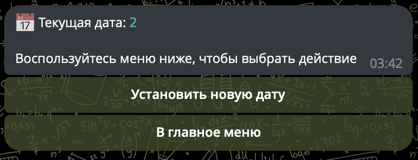
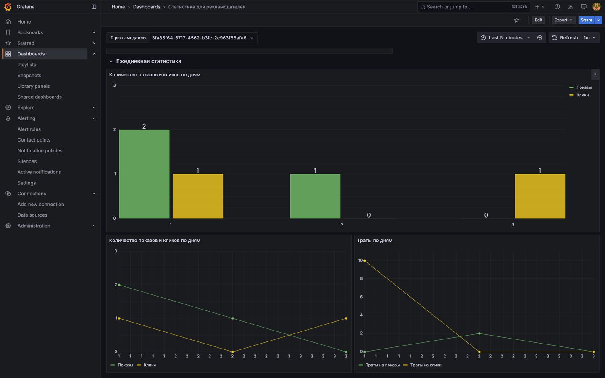

# "РЕКЛАМУШКА" - больше, чем рекламный движок

"РЕКЛАМУШКА" представляет собой технологичное B2B и B2C решение. Бизнес может запустить свою рекламную кампанию и
получить максимальные охваты, а пользователи увидеть релевантную для них рекламу.

Разработано API, а также доступен интерфейс в виде Telegram-бота и дашборды в Grafana.

# Оглавление:

1. [Стек технологий и внешние зависимости](#стек-технологий-и-внешние-зависимости)
2. [Инстукция по запуску](#инстукция-по-запуску)
    - [Секреты приложения](#секреты-приложения)
    - [Основные сервисы в docker-compose](#docker-compose-состоит-из-следующих-сервисов)
    - [Настройка alertmanager](#настройка-alertmanager)
3. [Демонстрация работы приложения](#демонстрация-работы-приложения)
    - [API и сопуствующие сервисы](#api-и-сопуствующие-сервисы)
        - [Пользовательские сценарии для клиентов](#пользовательские-сценарии-для-клиентов)
        - [Пользовательские сценарии для рекламодателей](#пользовательские-сценарии-для-рекламодателей)
        - [Пользовательские сценарии для администратора](#пользовательские-сценарии-для-администратора)
    - [Бот](#бот)
    - [Визуализация. Дашборды Grafana](#визуализация-дашборды-grafana)
    - [Визуализация. Дашборд хранилища S3](#визуализация-дашборд-хранилища-s3)
4. [Схема базы данных](#схема-базы-данных)
5. [Описание работы основных точек входа](#описание-работы-основных-точек-входа)
    - [Краткое описание ручек](#краткое-описание-ручек)
    - [Алгоритм подбора рекламы](#алгоритм-подбора-рекламы)
    - [Внедренный AI](#внедренный-ai)
        - [Модерация рекламных кампаний](#модерация-рекламных-кампаний)
        - [Генерация заголовков и текстов рекламных кампаний](#генерация-заголовков-и-текстов-рекламных-кампаний)
6. [Тестирование](#тестирование)

# Стек технологий и внешние зависимости

В этом разделе представлены используемые технологии и зависимости с обоснованием их выбора.

В целом, данные инструменты были выбраны из-за их популярности, удобства разработки и перспективы масштабирования.

| Инструмент               | Описание                                                                                                                                                                                                                                                             |
|--------------------------|----------------------------------------------------------------------------------------------------------------------------------------------------------------------------------------------------------------------------------------------------------------------|
| Python                   | Универсальный язык программирования, удобен для разработки в сжатые сроки                                                                                                                                                                                            |
| FastAPI                  | Высокопроизводительный веб-фреймворк. Автоматически генерирует документацию к API, поддерживает удобную валидацию                                                                                                                                                    |
| Pytest                   | Популярный фреймворк для тестирования на python                                                                                                                                                                                                                      |
| PyTelegramBotApi         | Популярная библиотека для разработки Телеграм-ботов                                                                                                                                                                                                                  |
| SQLAlchemy               | популярный ORM для работы с базами данных                                                                                                                                                                                                                            |
| PostgreSQL               | СУБД для работы с реляционными БД, поддерживает хорошую скорость работы, поддерживает масштабирование. Открытый исходный код                                                                                                                                         |
| Redis                    | Высокопроизводительная СУБД для работы с NoSQL БД, кэширует необходимые данные для повышения производительности. Открытый исходный код                                                                                                                               |
| MinIO                    | Высокопроизводительная объектная система хранения данных с открытым исходным кодом. Легко масштабируется, S3-совместимая, имеет удобный веб-интерфейс, автоматически сжимает файлы без особой потери качества (мое изображение, которое весило 7МБ сжала в 17,4 раз) |
| Docker и Docker Compose  | Позволяет создавать контейнеры, автоматизировать их запуск и развёртывание. Запускать несколько связанных контейнеров                                                                                                                                                |
| Prometheus               | Система мониторинга с открытым исходным кодом. Используется для сбора технической статистики, обеспечения мониторинга и оповещения об изменениях в приложениях и инфраструктуре                                                                                      |
| Prometheus node-exporter | Используется для мониторинга метрик системы                                                                                                                                                                                                                          |
| Prometheus Alertmanager  | В случае сбоев высылает предупреждения в телеграм. Пример:                                                                                                                                                                              |
| Grafana                  | Инструмент с открытым исходным кодом для визуализации данных. Имеет удобный веб-интерфейс                                                                                                                                                                            |
| YandexGPT API            | Дает доступ к LLM модели для генерации рекламных текстов и модерации сообщений. Отностительно быстрая скорость генерации и хорошее качество. Справляется лучше, чем небольшие модели, развернутые локально. Специализируется на русском языке                        |

# Инстукция по запуску:

1. Скопируйте данный репозиторий

```bash
git clone git@gitlab.prodcontest.ru:2025-final-projects-back/Tanax-Xt.git
```

2. При необходимости отредактируйте секреты приложения. Про них чуть [ниже](#секреты-приложения)

3. Запустите проект через docker-compose. Про его устройство [ниже](#docker-compose-состоит-из-следующих-сервисов)

```bash
docker compose up -d
```

После этого дождитесь запуска контейнеров (при первом запуске время билда 3-5 минут в зависимости от
интернет-соединения).

4. **Документация API** будет доступна по адресу http://localhost:8080/docs
5. Чтобы использовать `Grafana`, перейдите http://localhost:3000 логин/пароль - admin/admin
   > В первое время не для всех графиков могут собраться данные, в таком случае необходимо просто обновить сайт
   через некоторое время
6. Бот будет запущен здесь http://t.me/marketing_management_system_bot
7. Остановить проект можно командой

```bash
docker compose down
```

## Секреты приложения

Секреты приложения намеренно вынесены в docker-compose, согласно требованиям.

При необходимости, замените следующие поля на свои (если вы будете менять секреты, связанные с БД или МИНИО,
продублируйте свои действия в файле [src/config.py](src/config.py)):

```
YANDEX_GPT_API_KEY=SECRET
FOLDER_ID=SECRET

POSTGRES_DB=prod3
POSTGRES_USER=postgres
POSTGRES_PASSWORD=root

GF_SECURITY_ADMIN_USER=admin
GF_SECURITY_ADMIN_PASSWORD=admin

TELEGRAM_ID=SECRET
TELEGRAM_ALERT_BOT_TOKEN=SECRET

TELEGRAM_BOT_TOKEN=SECRET

MINIO_ROOT_USER=root
MINIO_ROOT_PASSWORD=password
```

## Docker-compose состоит из следующих сервисов:

- `backend` - основное приложение, реализующее API. Стартует только после:
    - Запуска Redis
    - Запуска базы данных для продакшена
    - Запуска тестов
- `db` - продакшен база данных
- `redis` - бд для хэширования
- `test` - e2e-тесты. Стартует только после:
    - Запуска Redis
    - Запуска базы данных для тестов
- `db-test` - база данных для тестирования
- `prometheus` - сервис для сбора статистики
- `grafana` - сервис для визуализации статистики. Зависит от:
    - Запуска prometheus
- `alertmanager` - сервис для оповещения об инцидентах
- `bot` - поднимает тг-бота для взаимодействия с бэкендом. Бот будет доступен
  в [@marketing_management_system_bot](http://t.me/marketing_management_system_bot). Зависит от:
    - Запуска бэкенда
- `s3-storage` - сервис для хранения данных в S3

## Настройка alertmanager

В `docker-compose` в сервисе `alertmanager` замените `TELEGRAM_ID` на свой, если хотите получать уведомления в
Телеграме.

> Для того, чтобы узнать свой id можно воспользоваться сторонним сервисом,
> например, [данным ботом](https://t.me/MyTidBot).
>
> ❗ Ссылка ведет на сторонний ресурс, не имеющий отнощения к автору решения. Автор решения не гарантирует стабильную
> работу данного бота и не отвечает за контент в нем

# Демонстрация работы приложения

## API и сопуствующие сервисы

### Пользовательские сценарии для клиентов

#### Сценарий 1. Взаимодействие с аккаунтом

Воспользоваться ручкой `POST /clients/bulk` и зарегистрироваться в системе

Воспользоваться ручкой `GET /clients/{clientId}` и получить информацию о своем профиле

#### Сценарий 2. Взаимодействие с рекламой

Воспользоваться ручкой `GET /ads` и получить наиболее подходящее рекламное объявление

Воспользоваться ручкой `POST /ads/{adId}/click` и зафиксировать переход по рекламному объявлению

### Пользовательские сценарии для рекламодателей

#### Сценарий 1. Взаимодействие с аккаунтом

Воспользоваться ручкой `POST /advertisers/bulk` и зарегистрироваться в системе

Воспользоваться ручкой `GET /advertisers/{advertiserId}` и получить информацию о своем профиле

#### Сценарий 2. Взаимодействие с рекламой

Воспользоваться ручкой `POST /ml-scores` и добавить метрику ml-скора для клиента

Воспользоваться ручкой `POST /advertisers/{advertiserId}/campaigns` и создать рекламную кампанию. При создании кампании
воспользоваться ручкой `POST /ai/generate-text` для создания контента рекламной кампании.

Воспользоваться ручкой `PATCH /advertisers/{advertiserId}/campaigns/{campaignId}/image` и добавить изображение к рекламе
для привлечения внимания

Воспользоваться ручкой `GET /advertisers/{advertiserId}` и получить информацию о всех рекламных кампаниях

Воспользоваться ручкой `GET /advertisers/{advertiserId}/campaigns/{campaignId}` и получить информацию о конкретной
рекламной кампании

Воспользоваться ручкой `PUT /advertisers/{advertiserId}/campaigns/{campaignId}` и изменить рекламную кампанию

Воспользоваться ручкой `DELETE /advertisers/{advertiserId}/campaigns/{campaignId}` и удалить рекламную кампанию

#### Сценарий 3. Работа со статистикой

Воспользоваться сервисом `grafana` и получить визуализированную статистику по всему рекламному агентству или конкретной
рекламной кампании. Пример [ниже](#business-дашборды)

Воспользоваться ручками группы `/stats` и получить статистику по рекламодателю или конкретной рекламной кампании в JSON,
например, для последующей обработки

### Пользовательские сценарии для администратора

#### Сценарий 1. Работа с датами

Воспользоваться ручкой `POST /time/advance` и сменить текущую дату

Воспользоваться ручкой `GET /time` и получить текущую дату

#### Сценарий 2. Работа с дашбордами

Воспользоваться сервисами `grafana` и `prometheus` и получить информацию техническую информацию о работе приложения.
Инструкция [ниже](#technical-дашборды)

#### Сценарий 3. Настроить модерацию контента

Воспользоваться ручкой `POST /ai/moderation-campaigns`, чтобы активировать/деактивировать модерацию контента рекламных
кампаний

#### Сценарий 4. Получать уведомления в Телеграм о сбоях в работе сервисов

Быстро получать информацию о сбоях в работе сервисов с помощью alertmanager и иметь возможность быстро устранять их.


## Бот

В этом разделе я опишу взаимодействие с ботом. Некоторые схожие функции будут объеденины вместе и описаны без
скриншотов.

Также для удобства пользователей, бот присылает отформатированные сообщения, в которых по клику можно скопировать
отдельные фрагменты

### Главное меню бота


В главном меню бота описаны его возможности, а по кнопкам можно перейти в различные разделы. Рассмотрим их

### Управление клиентами


В данном разделе имеется возможность получить клиента по ID. Пример ответа:


А также можно добавить нового клиента. Пример ответа:


### Управление рекламодателями


В данном разделе имеется возможность получить рекламодателя по ID, добавить или обновить рекламодателя. Ответы на эти
запросы выглядят аналогично схожему функционалу для клиентов.

Также имеется возможность добавить ML-score для пары рекламодатель-клиент. Пример ответа:


### Управление рекламными кампаниями


В данном разделе собран весь функционал для взаимодействия с рекламными кампаниями

Имеется возможность переключить режим модерации контента с помощью ИИ в рекламных кампаниях.


Для удобства рекламодателей имеется возможность сгенерировать рекламную кампанию. Пример сценария:


Также здесь можно добавить рекламную кампанию, получить все кампании рекламодателя или конкретную кампанию. Ответ бота
во всех случаях будет аналогичен скриншоту:


Также доступно обновление таргетинга рекламной кампании, ее изображение, а также удаление рекламной кампании

### Рекламные объявления


В данном разделе можно получить рекламное объявление для клиента. В таком случае будет доступен упрощенный интерфейс
фиксации клика по рекламе Примеры с изображением и без:


А также можно напрямую зафиксировать клик по рекламе с помощью ID рекламного объявления и клиента (при этом если до
этого показа не было, то клик не засчитается). Пример:


### Получить статистику


В данном разделе можно получить статистику по рекламодателю или конкретной рекламной кампании, а также статистику по
дням.

Пример получения статистики (получение статистики по рекламной кампании и рекламодателю несильно отличаются):


Пример получения статистики по дням (получение статистики по рекламной кампании и рекламодателю несильно отличаются):


### Управление датой



В данном разделе можно просмотреть текущую дату и сменить ее. Пример взаимодействия (после клика на кнопку "Установить
новую дату"):


### Обработка ошибок

В боте обрабатываются возможные ошибки, которые возвращает API. Пример:


## Визуализация. Дашборды Grafana

В Grafana дашборды поделены мной на две группы: `business` и `technical`, они обозначены тегами.

> Ссылка на Grafana - http://localhost:3000/dashboards. Логин/пароль - admin/admin

### Business дашборды

На таких дашбордах содержится статистика различных бизнес-модулей приложения

#### Статистика для рекламодателей

Дашборд для рекламодателей условно поделен на 2 части: с общей статистикой и разбивкой по дням. Для улучшения
пользовательского опыта вверху дашборда находится выпадающий список, с помощью которого можно выбрать по какому
рекламодателю строить графики.

Общая статистика

Статистика по дням


#### Статистика по рекламной кампании

Дашборд со статистикой по рекламном кампании имеет аналогичный вид и функционал с дашбордом для рекламодателей.
рекламодателю строить графики.

### Technical дашборды

Эти дашборды содержат более техническую информацию

#### FastAPI Observability

Дашборд с информацией об API, содержит информацию о количестве запросов, количестве различных групп ответов и другую
полезную информацию


#### Node Exporter Full

Дашборд с информацией о системе. Например, о нагрузке на процессор или память.


## Визуализация. Дашборд хранилища S3

Дашборд с информацией об использовании хранилища S3. Доступен по адресу http://localhost:9001/tools/metrics.
Логин/пароль - root/password


# Схема базы данных

База данных представляет из себя 5 различных таблиц: `advertiser`, `client`, `campaign`, `ml_score`
и `client_to_campaign`.

**advertiser** - рекламодатель:

- `id` - айди рекламодателя. Создается автоматически или может быть задан пользователем
- `name` - название рекламодателя
- `created_at` - дата и время создания. Создается автоматически

**client** - клиент:

- `id` - айди клиента. Создается автоматически или может быть задан пользователем
- `login` - логин клиента
- `age` - возраст клиента
- `location` - локация клиента
- `gender` - пол клиента
- `created_at` - дата и время создания. Создается автоматически

**ml-score** - мл-скор:

- `id` - айди скора. Создается автоматически
- `client_id` - айди клиента
- `advertiser_id` - айди рекламодателя
- `score` - значение скора
- `created_at` - дата и время создания. Создается автоматически

**campaigns** - рекламная кампания:

- `id` - айди кампании. Создается автоматически
- `advertiser_id` - айди рекламодателя
- `impressions_limit` - лимит показов
- `clicks_limit` - лимит кликов
- `cost_per_impression` - цена показа
- `cost_per_click` - цена клика
- `ad_title` - название объявления
- `ad_text` - текст объявления
- `start_date` - дата начала
- `end_date` - дата конца
- `gender` - таргетинг, пол целевой аудитории. Необязательное поле
- `age_from` - таргетинг, нижняя граница возраста целевой аудитории. Необязательное поле
- `age_to` - таргетинг, верхняя граница возраста целевой аудитории. Необязательное поле
- `location` - таргетинг, локация целевой аудитории. Необязательное поле
- `image_url` - название изображения объявления в S3-хранилище. Необязательное поле
- `created_at` - дата и время создания. Создается автоматически

**client_to_campaign** - фиксация взаимодействия клиента с рекламной кампанией:

- `id` - айди сущности. Создается автоматически
- `client_id` - айди клиента
- `campaign_id` - айди кампании
- `is_show` - флаг того, показано ли рекламное объявление
- `is_click` - флаг того, был ли переход по рекламному объявлению. По умолчанию false
- `cost_per_impression_for_client` - цена показа
- `cost_per_click_for_client` - цена клика. Необязательное поле
- `data_show` - дата показа.
- `data_click` - дата клина. Необязательное поле
- `created_at` - дата и время создания. Создается автоматически


Также используется хранилище Redis для кэширования даты и состояния модерации.

# Описание работы основных точек входа

## Краткое описание ручек

`GET /metrics` - отдает технические метрики для построение дашборда об api

### Artificial intelligence

`POST /ai/moderation-campaigns` - принимает флаг того, необходимо ли модерировать контент рекламный кампаний. По
умолчанию `false`

`POST /ai/generate-text` - генерирует заголовок и текст рекламной кампании. Учитывает то, что по контексту реклама - это
банеры в интернете и генерирует небольшие тексты

### Clients

`GET /clients/{clientId}` - получение клиента по ID

`POST /clients/bulk` - массовое создание/обновление клиентов

### Advertisers

`GET /advertisers/{advertiserId}` - получение рекламодателя по ID

`POST /advertisers/bulk` - массовое создание/обновление рекламодателей

`POST /ml-scores` - принимает значение ml-скора пары клиент-рекламодатель

`GET /advertisers-ids` - получение ID всех рекламодателей. Используется для упрощения пользовальского опыта при
построении дашбордов

`GET /campaigns-ids` - получение ID всех рекламных кампаний. Используется для упрощения пользовальского опыта при
построении дашбордов

### Campaigns

`POST /advertisers/{advertiserId}/campaigns` - создание рекламной кампании

`GET /advertisers/{advertiserId}/campaigns` - получение всех рекламных кампаний рекламодателя

`GET /advertisers/{advertiserId}/campaigns/{campaignId}` - получение рекламной кампании

`PUT /advertisers/{advertiserId}/campaigns/{campaignId}` - изменение рекламной кампании, часть полей возможно изменить
только до старта кампании

`DELETE /advertisers/{advertiserId}/campaigns/{campaignId}` - удаление рекламной кампании

`PATCH /advertisers/{advertiserId}/campaigns/{campaignId}/image` - добавление/изменение изображения рекламной кампании

`GET /advertisers/{advertiserId}/campaigns/{campaignId}/image` - получить изображение рекламной кампании

### Ads

`GET /ads?client_id={clientId}` - получение рекламного объявления для клиента. О работе алгоритма подбора рекламы
чуть [ниже](#алгоритм-подбора-рекламы)

`POST /{adId}/click` - фиксация клика по рекламному объявлению

### Statistics

`GET /stats/advertisers/{advertiserId}/campaigns` - получение статистики по всем рекламным кампаниям рекламодателя

`GET /stats/advertisers/{advertiserId}/campaigns/daily` - получение агрегированной по дням статистики по всем рекламным
кампаниям рекламодателя

`GET /stats/campaigns/{campaignId}` - получение статистики по рекламной кампании

`GET /stats/campaigns/{campaignId}/daily` - получение агрегированной по дням статистики по рекламной кампании

### Time

`POST /time/advance` - изменение текущей даты

`GET /time` - получение текущей даты

## Алгоритм подбора рекламы

Для подбора оптимального рекламного объявления разработан следующий алгоритм:

1. Фильтруем рекламные кампании по таргету и тому, что они проходят в текущую дату. Оставляем только подходящие
2. Фильтруем по ранее непоказанным кампаниям. Оставляем только подходящие
3. Фильтруем по количеству показов. Если есть кампании, для
   которых `количество показов с учетом текущего показа <= 1.5 *
   лимит показов`, то оставляет только их. Иначе возвращает ошибку 404
4. Выдает пользователю рекламу, для которой максимален показатель `score`, рассчитывающийся по следующей формуле

score<sub>i</sub> = 0.25 * norm_ml_score<sub>i</sub> + 0.65 * (cost_per_impression<sub>i</sub> + norm_ml_score<sub>
i</sub> * cost_per_click_i) / max_cost - 0.75 * (penalty_impressions<sub>i</sub> + penalty_clicks<sub>i</sub>) -
показатель `score` для i-ого объявления

norm_ml_score<sub>i</sub> = ml_score<sub>i</sub> / ml_score<sub>max</sub> - нормированное на максимальное значение
ml_score значение ml_score i-ого объявления

max_cost = cost_per_impression<sub>max</sub> + cost_per_click<sub>max</sub> - максимальная стоимость за показ и клик
среди всех подходящих под фильтры объявлений

penalty_impressions<sub>i</sub> = (impressions<sub>i</sub> - impressions_limit<sub>i</sub>) / impressions_limit<sub>
i</sub> - штраф за превышение лимита показов, если количество показов меньше лимита, то положительно влиет на
показатель `score`, если больше - отрицательно

penalty_clicks<sub>i</sub> = (clicks<sub>i</sub> - clicks_limit<sub>i</sub>) / clicks_limit<sub>i</sub> - штраф за
превышение лимита кликов, если количество кликов меньше лимита, то положительно влиет на показатель `score`, если
больше - отрицательно

> Нормирование для всех слагаемых в формуле `score` необходимо для того, чтобы иметь возможность корректно (не имея
> перекоса в какую либо сторону из-за несоизмеримых значений) складывать их между собой

## Внедренный AI

В качестве LLM для внедрения в проект выбрана YandexGPT 4 Lite. Она обладает хорошим качеством и высокой скоростью
генерации ([источник](https://ya.ru/ai/gpt-4))

### Модерация рекламных кампаний

По умолчанию модерация отключена для того, чтобы не препятсвовать автоматическим тестам. Ее можно включить, послав
запрос
`POST /ai/moderation-campaigns` с телом `{"current_state": true}`. После этого при регистрации или изменении рекламных
кампании их содержание будет модерироваться. Модерация проходит с помощью YandexGPT и занимает несколько секунд.
Использование нейросети покрывает бОльшую часть необходимой модерации, а также учитывает контекст и минимизирует ложные
срабатывания. Ознакомиться с промптом можно в [файле](src/ai/moderation.py)

### Генерация заголовков и текстов рекламных кампаний

Текст для рекламной кампании можно сгенерировать с помощью эндпоинта `POST /ai/generate-text`.

При этом тело запроса может содержать 4 параметра:

```json
{
  "product": "название продукта",
  "advertiser_name": "название рекламодателя",
  "audience": "целевая аудитория",
  "target": "целевое действие"
}
```

Первые два поля `product` и `advertiser_name` указать обязательно, а поля `audience` и `target` необязательны. При
этом если `audience` и `target` не переданы, то по умолчанию они равны `audience` = `охвати как можно больше людей`
и `target` = `покупка`.

Генерация текста займет несколько секунд, при этом результат будет адаптирован под контекст того, что реклама
показывается в качестве рекламных банеров, и намеренно имеет небольшую длину. Пример реального ответа:

```json
{
  "title": "Вкусные грузинские пельмени в ресторане 'Никития'",
  "text": "Попробуйте наши сочные и ароматные грузинские пельмени! Закажите прямо сейчас"
}
```

Ознакомиться с промптом можно в [файле](src/ai/generate_text.py)

# Тестирование

Тесты реализованы в помощью библиотеки `pytest`, e2e-тесты полностью тестируют модули и ручки от начала до конца для
обеспечения контролируемого поведения работы бэкенда. Тесты охватывают большинство сценариев работы бэкенда.

Результаты e2e-тестирования можно увидеть в контейнере `test` в докер-композе

**Покрытие e2e-тестами на данный момент: 80%**